# Дисковая подсистема

## Задание: "Работа с mdadm"

### Цель: научиться использовать утилиту для управления программными RAID-массивами в Linux

#### Собрать RAID-0/1/5/10 — на выбор

- Создал диски, через GUI VirtualBox
  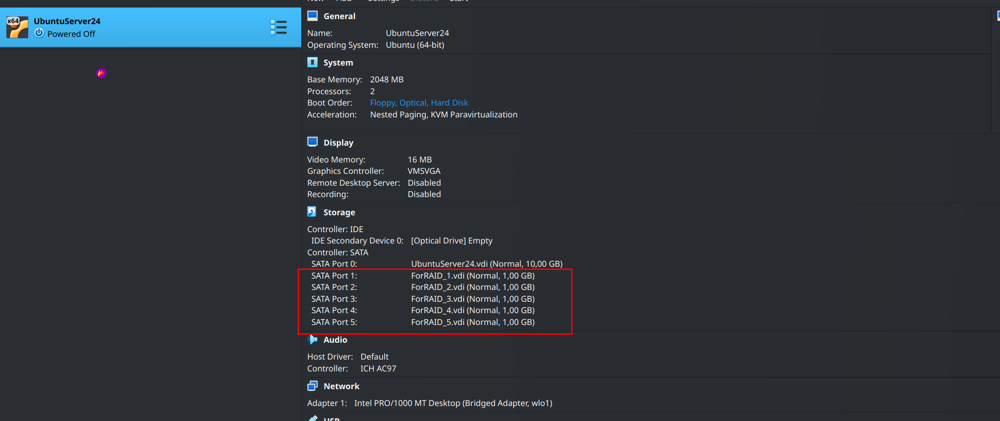
- Проверил наличие дисков в системе
  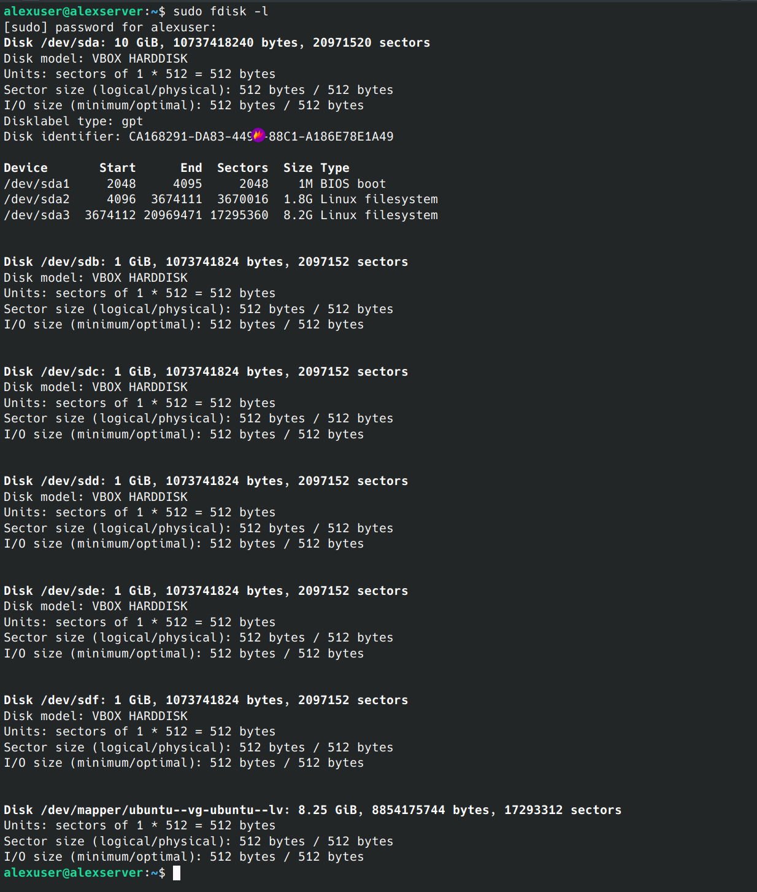
- Попытка занулить суперблок (ошибка т.к. диски не были в RAID)
  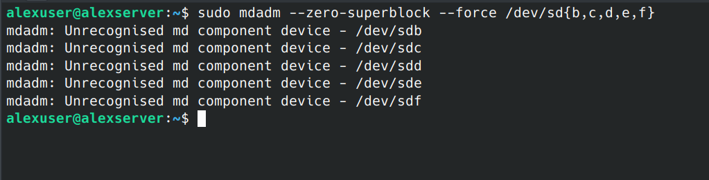
- Создание RAID 10 из 4 дисков
  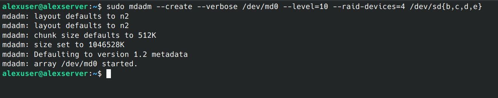
- Проверка что RAID массив собрался успешно
  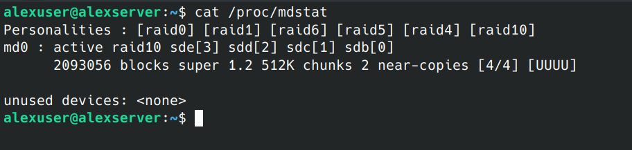
  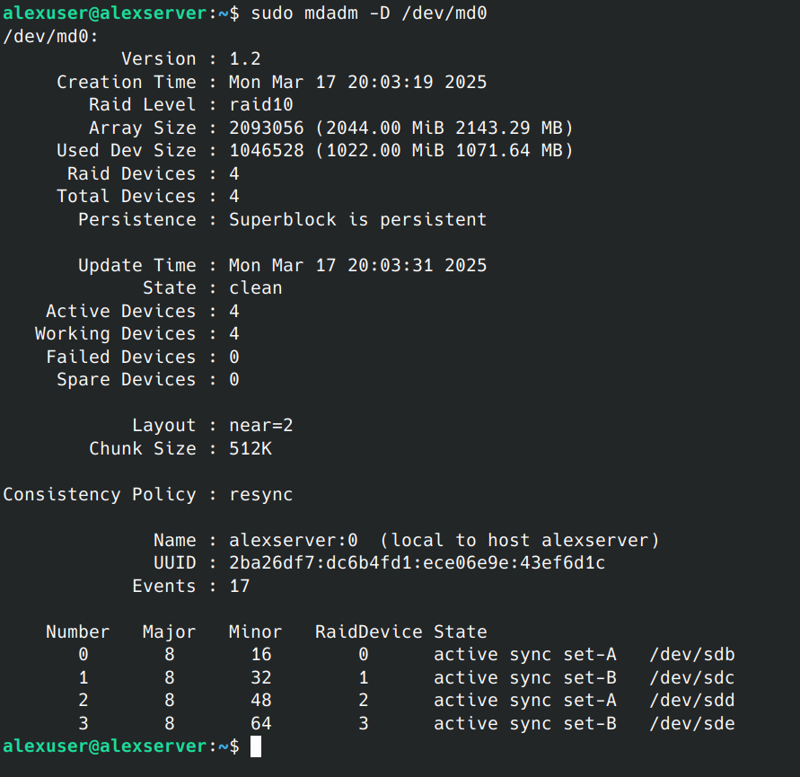

#### Сломать и починить RAID

- Фейлим диск
  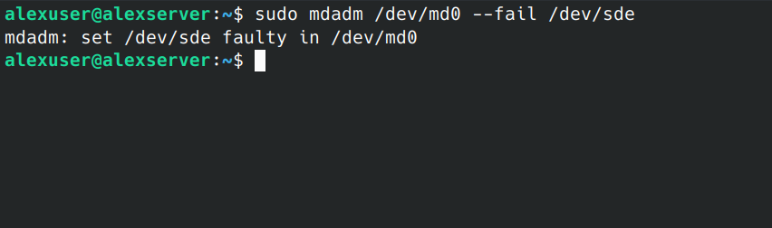
- Проверка состояния
  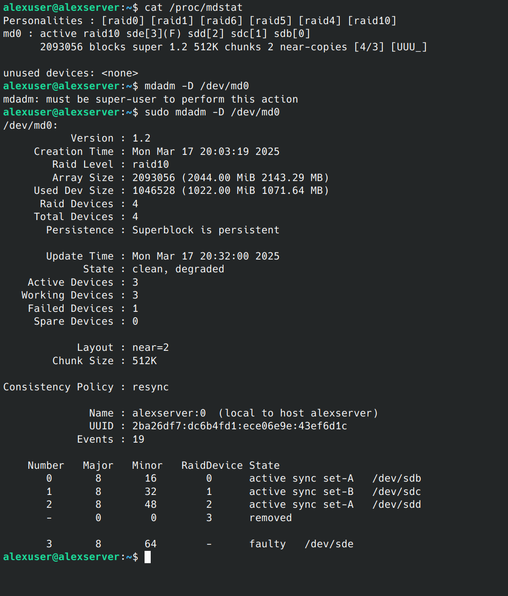
- Удаляем “сломанный” диск из массива
  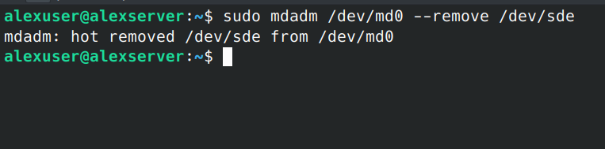
- Вставляем новый диск
  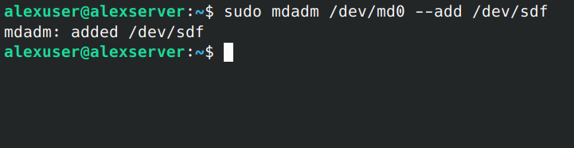
- Проверяем что новый диск добавился в массив
  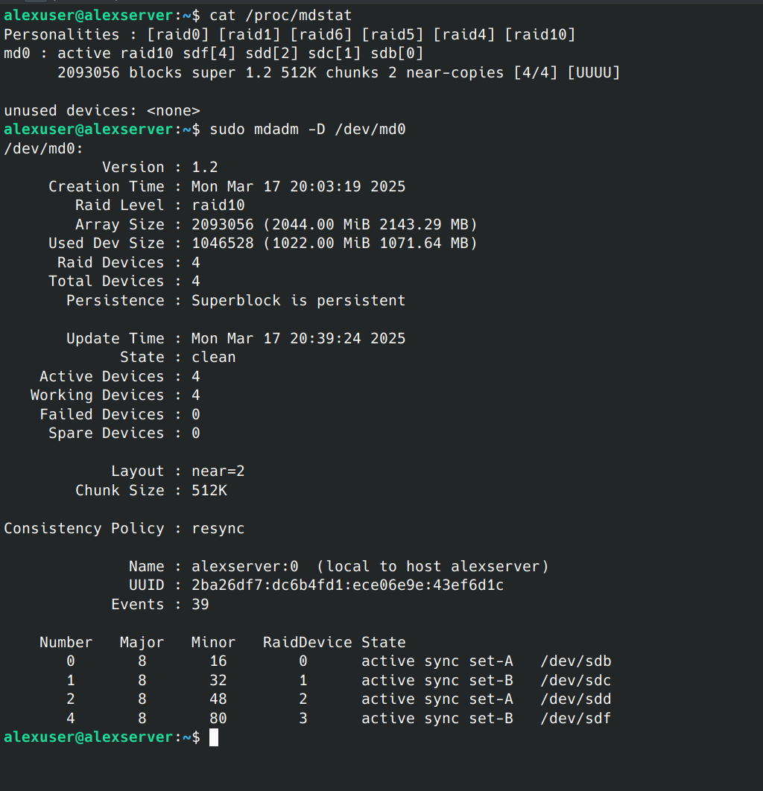

#### Создать GPT таблицу, пять разделов и смонтировать их в системе

- Создание таблицы разделов и разделов
  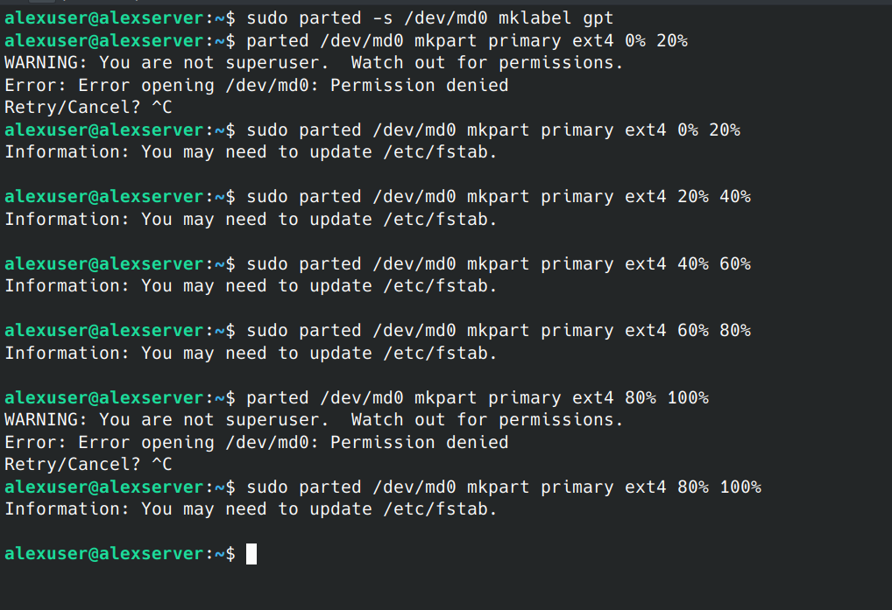
- Создание файловых систем
  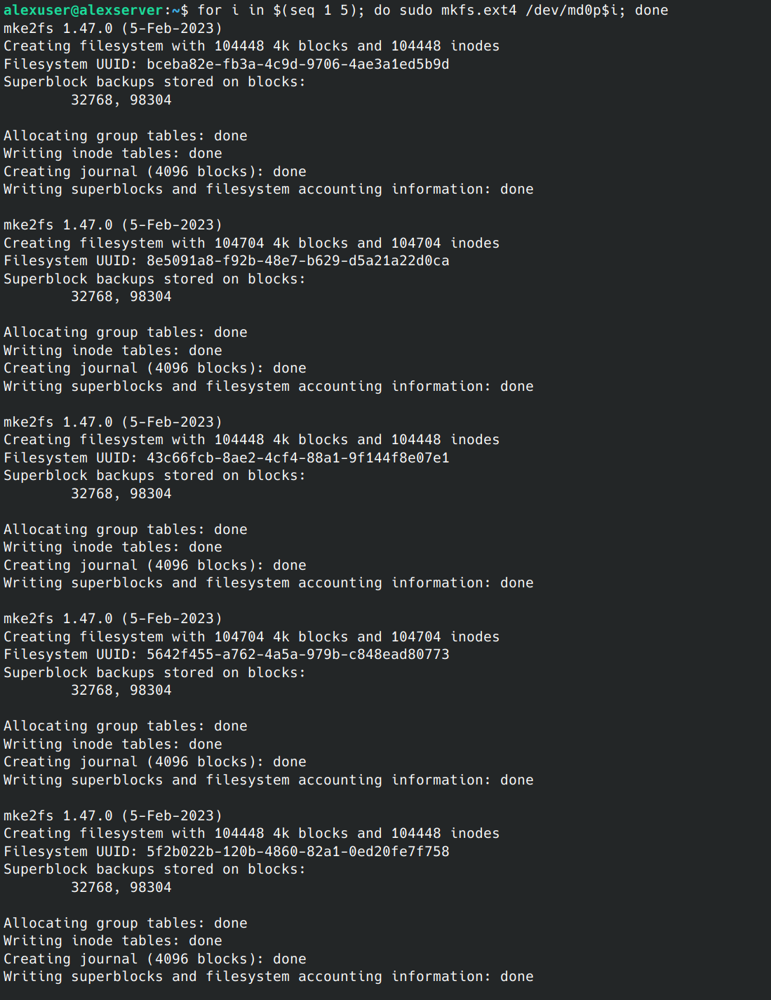
- Монтирование разделов
  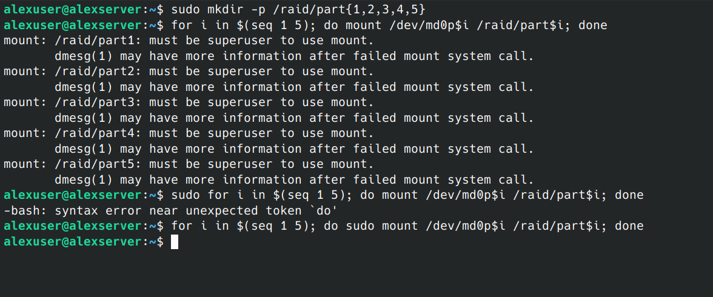
- Такой интересный вывод команды lsblk мы получили 😁
  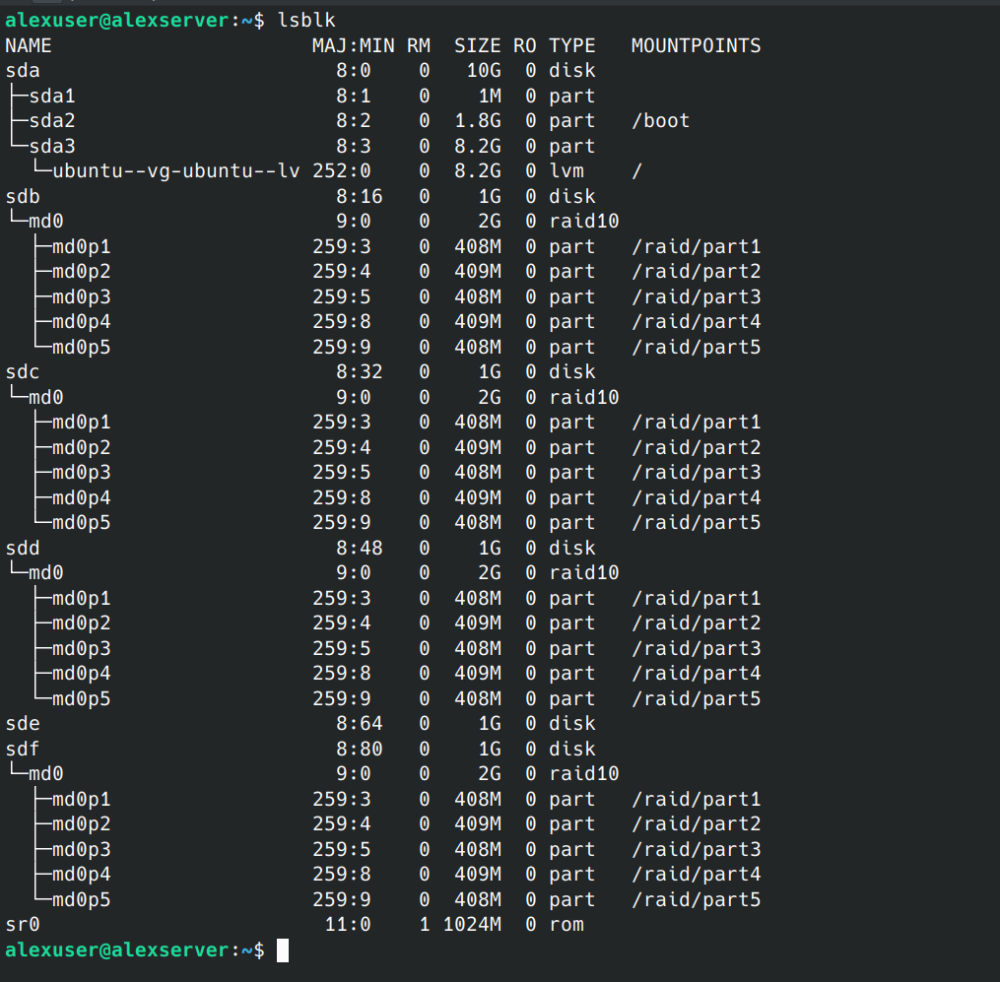
