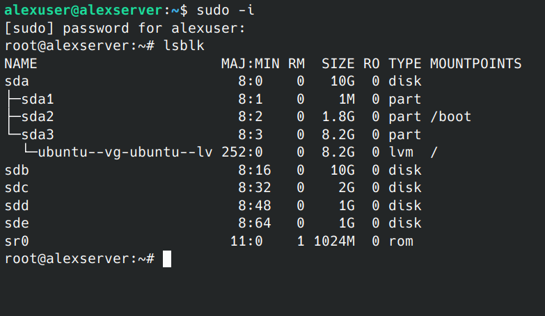
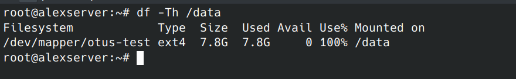
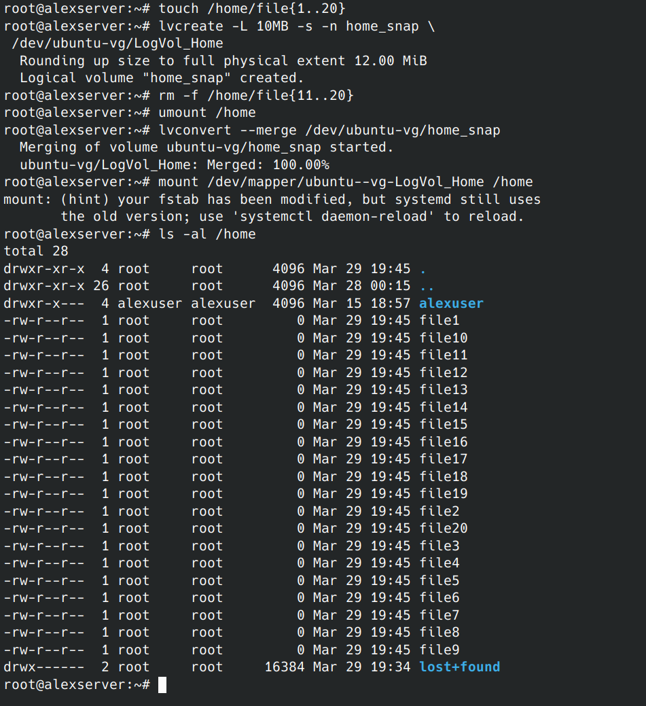

# Файловые системы и LVM

## Задание: "Работа с LVM"

### Цель: создавать и управлять логическими томами в LVM

#### LVM - начало работы

- Проверка, что стенд соответствует тому, что описан в методичке
  
  
- Создаем первые Physical volume, Volume group и Logical volume
  
- Проверяем что получилось
  
- Создаём еще один LV из свободного места. На этот раз не
  экстентами, а абсолютным значением в мегабайтах:
  
- Создадим на LV файловую систему и смонтируем его
  

#### Расширение LVM

- Создаём новый PV и добавим его в VG
  
- Сымитируем занятое место
  
- Увеличиваем LV
  
- Но файловая система при этом осталась прежнего размера
  
- Произведем resize файловой системы
  
- Уменьшение существующего LV
  
  

#### Работа со снапшотами

- Создание снапшота
  
- Монтирование снапшота
  
- Откат на снапшот
  

#### Работа с LVM-RAID

- Работа с LVM-RAID
  
  
#### Уменьшить том под / до 8G

- Подготовка временного тома для / раздела
  
- Копируем все данные с / раздела в /mnt
  
  
- Доп настройки чтобы стартануть с новой систему
  
- Проверка после перезагрузки где смонирован /
  
- Изменяем размер старой VG и возвращаем на него рут
  
  

#### Выделить том под /var в зеркало

- На свободных дисках создаем зеркало
  
- Создаем на нем ФС и перемещаем туда /var
  
- На всякий случай сохраняем содержимое старого var
  
- Монтируем новый var в каталог /var
  
- Правим fstab для автоматического монтирования /var
  
- Перезагружаемся в новый (уменьшенный root) и удаляем
  временную Volume Group
  
  

#### Выделить том под /home

- Выделяем том под /home по тому же принципу что делали для /var
  

#### Работа со снапшотами
 
- Работа со снапшотами
  
