# NFS, FUSE

## Задание: "Работа с NFS"

### Цель: Научиться самостоятельно разворачивать сервис NFS и подключать к нему клиентов

#### Настройка сервера NFS

- Установим сервер NFS
  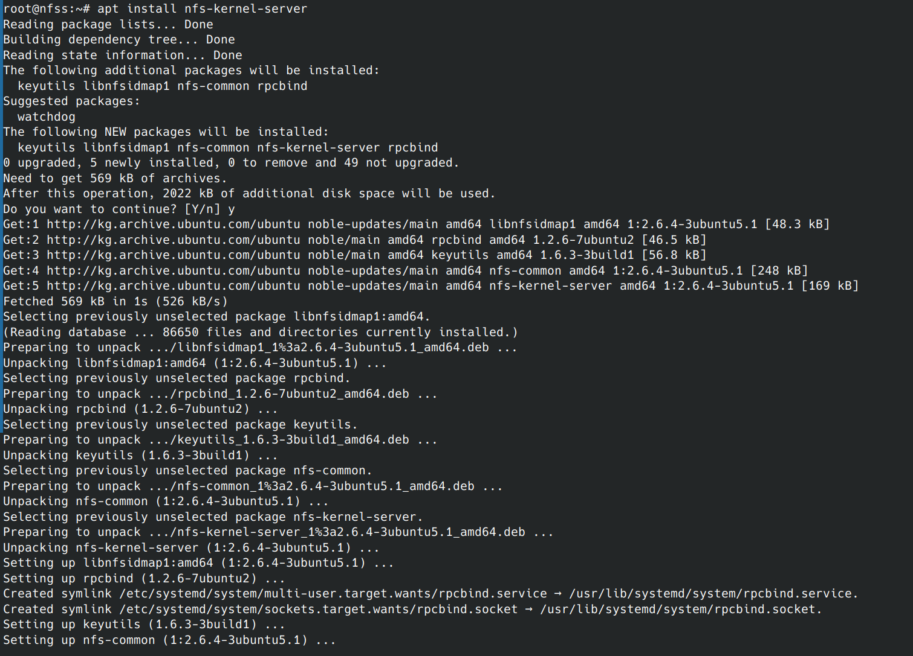
- Проверяем наличие слушающих портов
  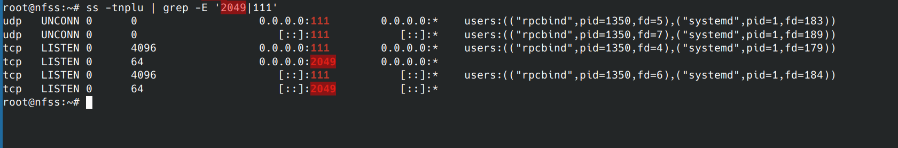
- Создаём и настраиваем директорию, которая будет экспортирована в будущем
  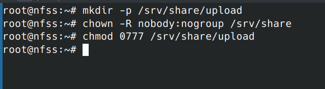
- Cоздаём в файле /etc/exports структуру, которая позволит экспортировать ранее созданную директорию
  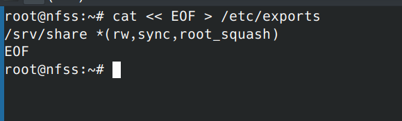
- Экспортируем ранее созданную директорию
  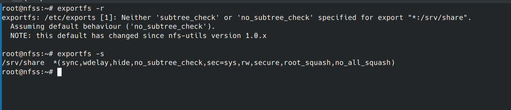
  
#### Настраиваем клиент NFS

- Установим пакет с NFS-клиентом
  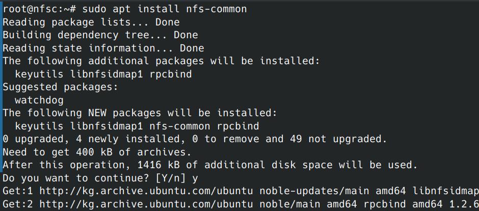
- Добавляем в /etc/fstab строку
  
- Перечитываем настройки и подключаем сетевые тома
  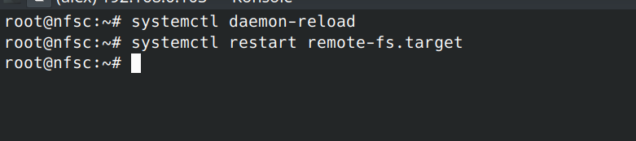
- Проверяем успешность монтирования
  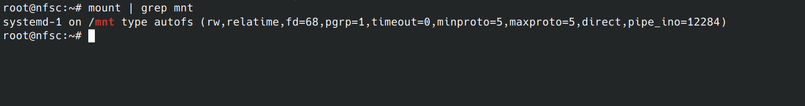

#### Проверки

- Создаём файл на сервере
  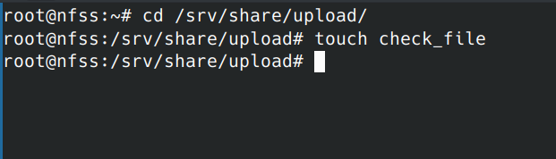
- Првоеряем что файл появился на клиенте
  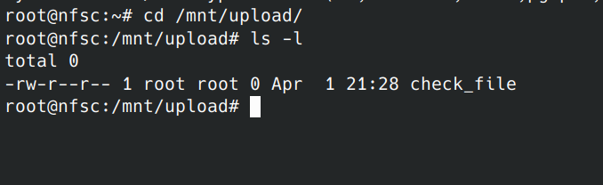
- Создаём тестовый файл на клиенте
  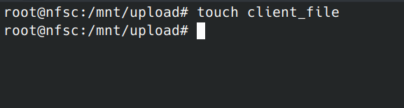
- Проверяем, что тестовй файл появился на сервере
  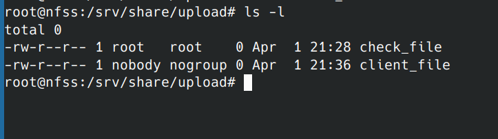

#### Финальные проверки

- Проверяем, что клиент после перезагрузки видит файлы на сервере
  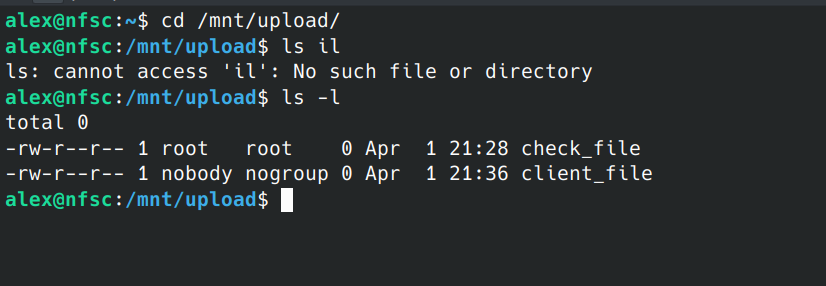
- Ребутим сервер, предварительно позаботясь о том, чтобы он получил тот же ip адресс, который был до этого
  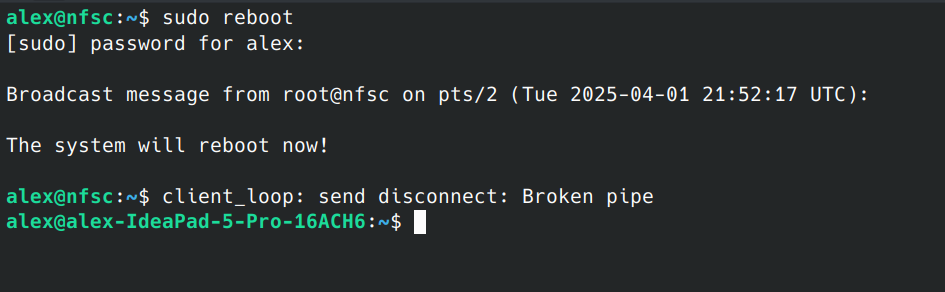
- Делаем проверки на сервере после ребута
  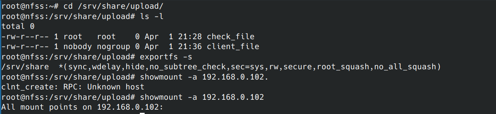
- Заключительные проверки на клиенте
  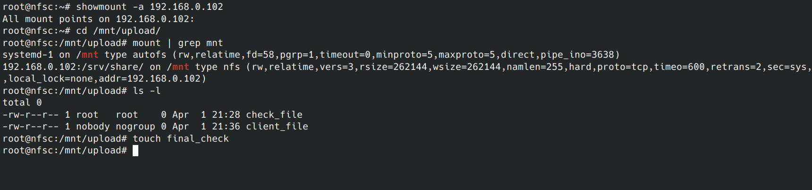
  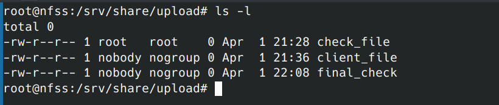

#### Делаем через скрипты

- Создаём скрип для сервера
  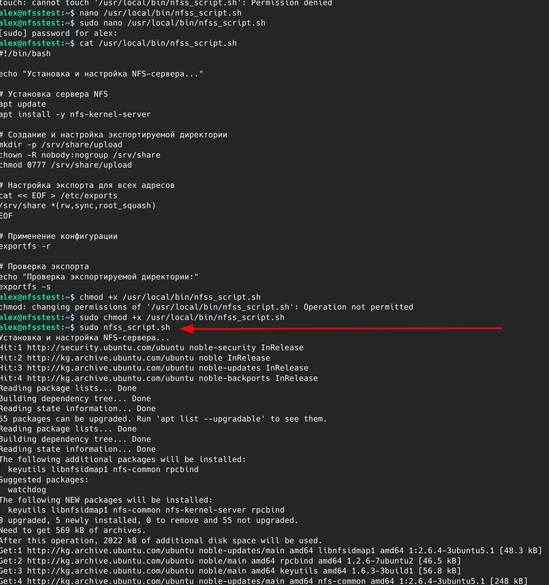
- Создаём скрипт на сервере, он принимает адресс сервера
  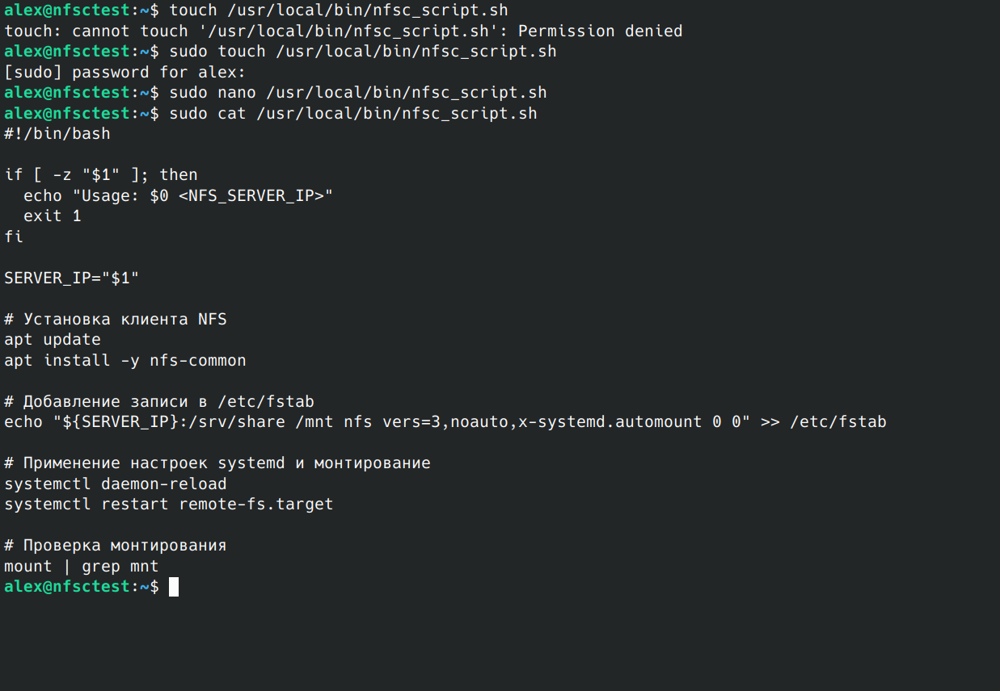
  
- Создам файл на сервере и прворяем что он появился на клиенте
  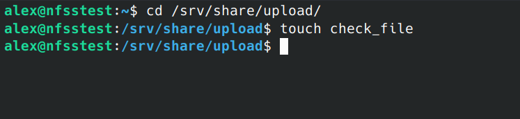
  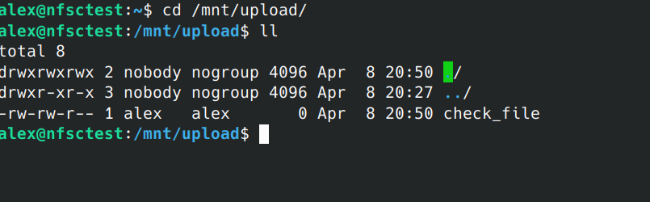

Работает 🎉🎉🎉

Скрипты положил тут рядом с README.md
