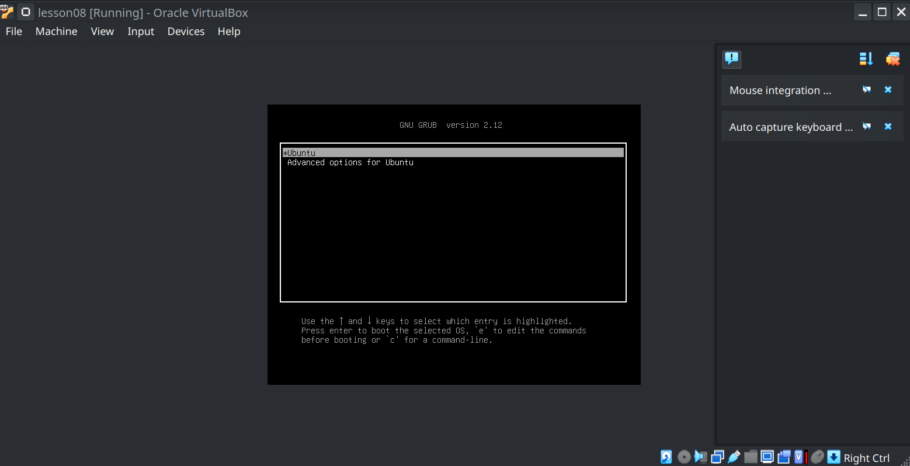
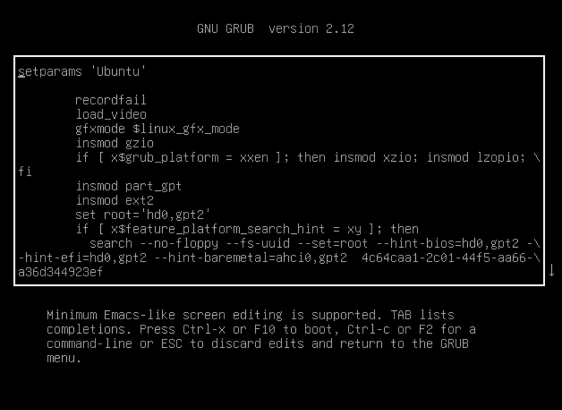
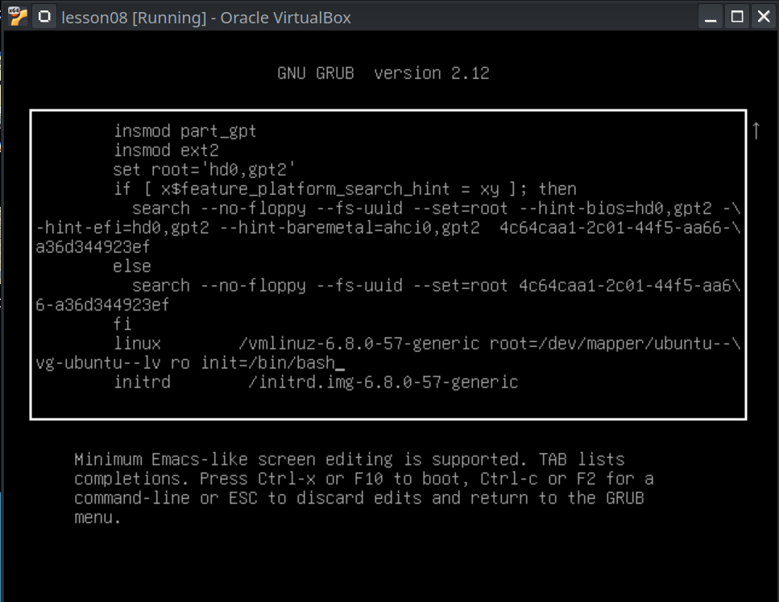
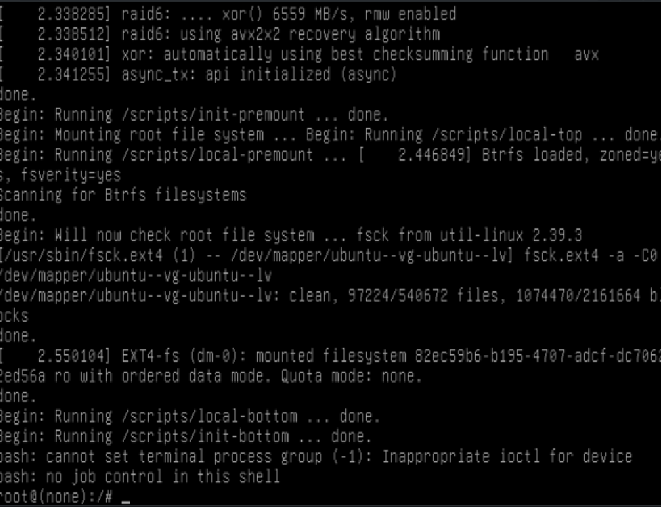
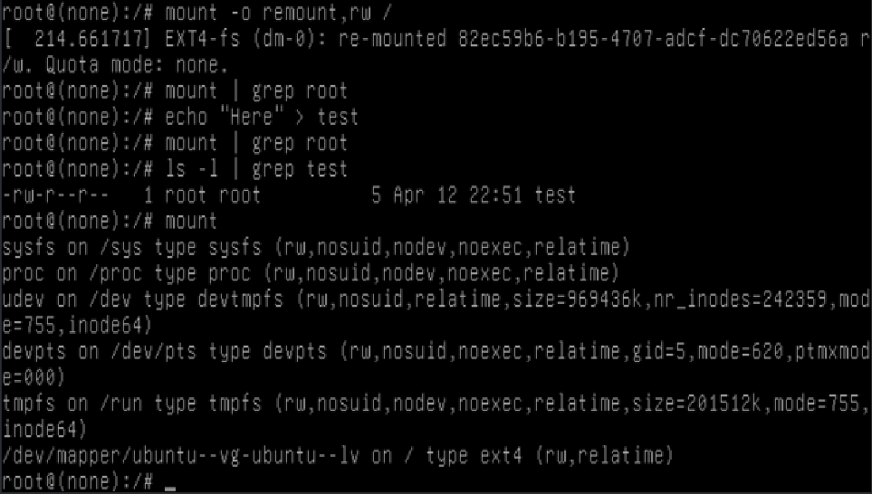
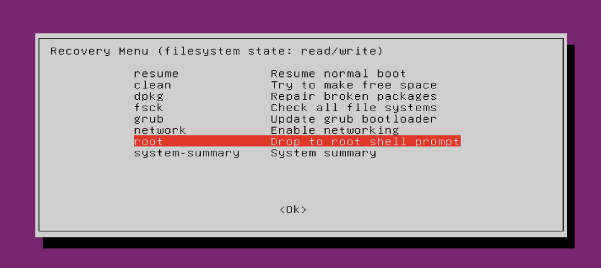
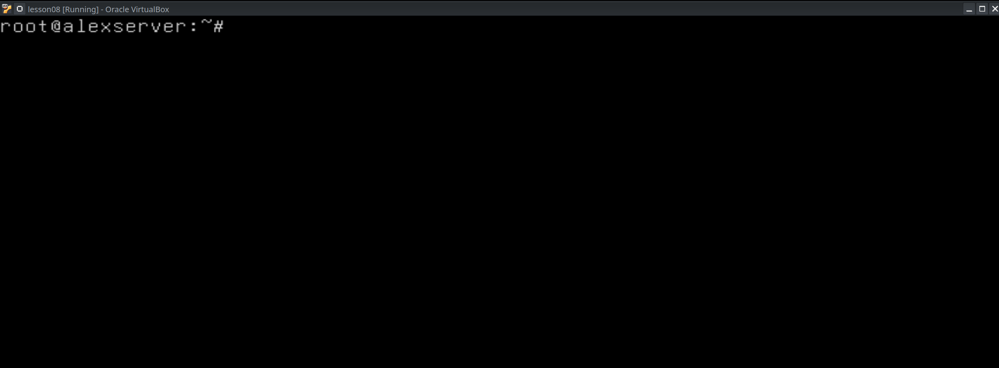
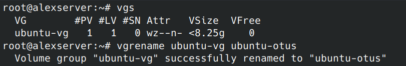
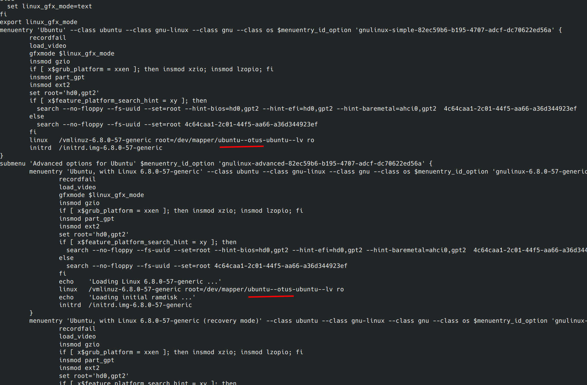
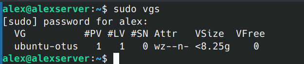

# Загрузка системы

## Задание: "Работа с загрузчиком"

### Цель: "Научиться попадать в систему без пароля.
Устанавливать систему с LVM и переименовывать в VG"

#### Включить отображение меню Grub

- Обновляем конфик чтобы при загрузке отображалось меню загрузчика
  
  

#### Попасть в систему без пароля несколькими способами

##### Способ 1. init=/bin/bash

- Переходим в окно редактирования парметров загрузки
  
- Прописываем init=/bin/bash
  
- Вход под рутом
  
- Перемонтируем рутовую файловую систему в режим Read-Write, можем создавать файлы, но почему-то ```mount | grep root``` ничего не выводит 🤷‍♂️
  
  
##### Способ 2. Recovery mode

- Загружаемся в риковери мод, и включаем нетворк, затем заходим под рутом
  
- Зашлось под рутом
  

#### Установить систему с LVM, после чего переименовать VG
 
- Смотрим список Volume Group
- Переименовываем Volume Group
  
- Редактируем /boot/grub/grub.cfg (почему-то вручную)
  
- После перезагрузки
  
