# Инициализация системы. Systemd

## Задание: "Systemd - создание unit-файла"

### Цель: "Научиться редактировать существующие и создавать новые unit-файлы"

#### Написать service, который будет раз в 30 секунд мониторить лог на предмет наличия ключевого слова

- Cоздаём файл с конфигурацией для сервиса в директории /etc/default
  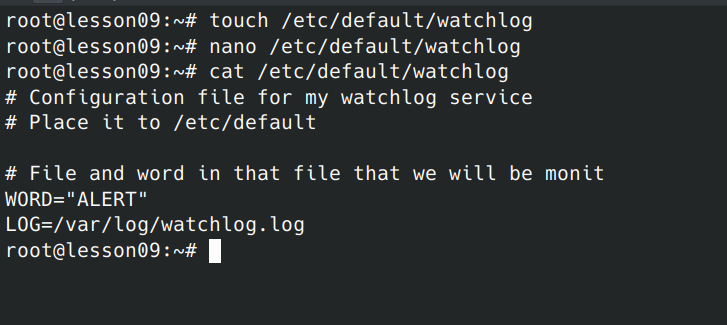
- Cоздаем /var/log/watchlog.log и пишем туда строки на своё усмотрение,
  плюс ключевое слово ‘ALERT’
  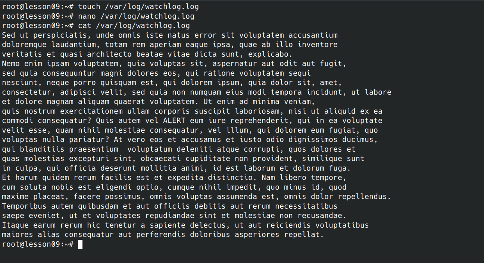
- Создадим скрипт. Добавим права на запуск файла
  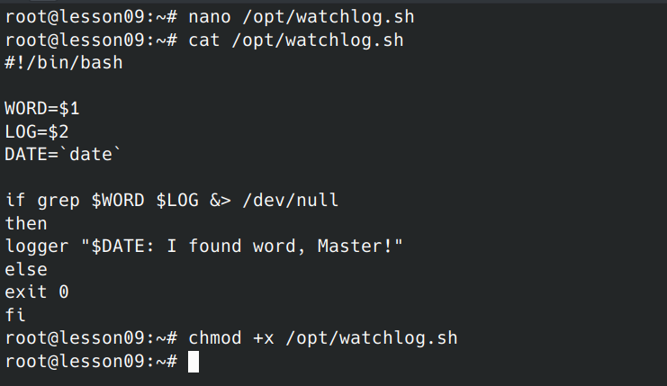
- Создадим юнит для сервиса
  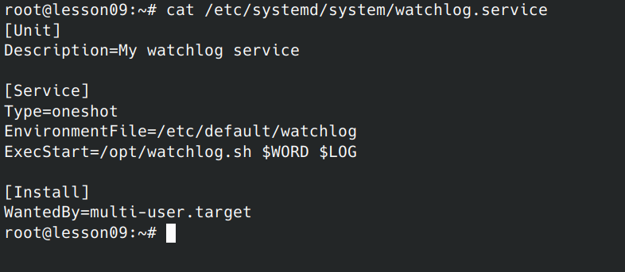
- Создадим юнит для таймера
  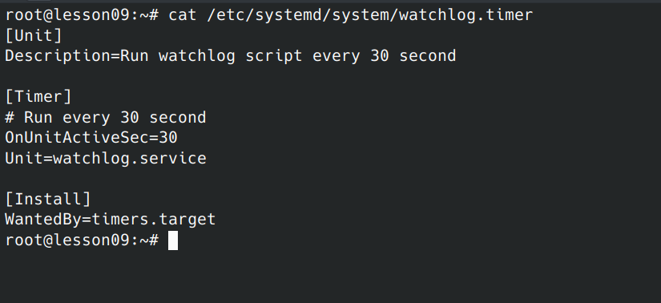
- Проверка работы таймера
  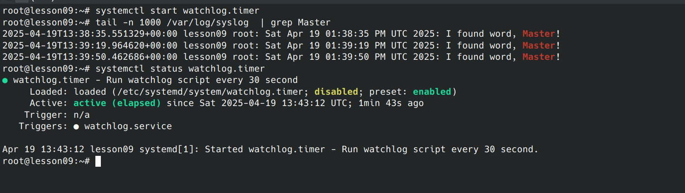

#### Установить spawn-fcgi и создать unit-файл (spawn-fcgi.sevice) с помощью переделки init-скрипта

- Cоздаём файл с настройками для будущего сервиса в файле /etc/spawn-fcgi/fcgi.conf
  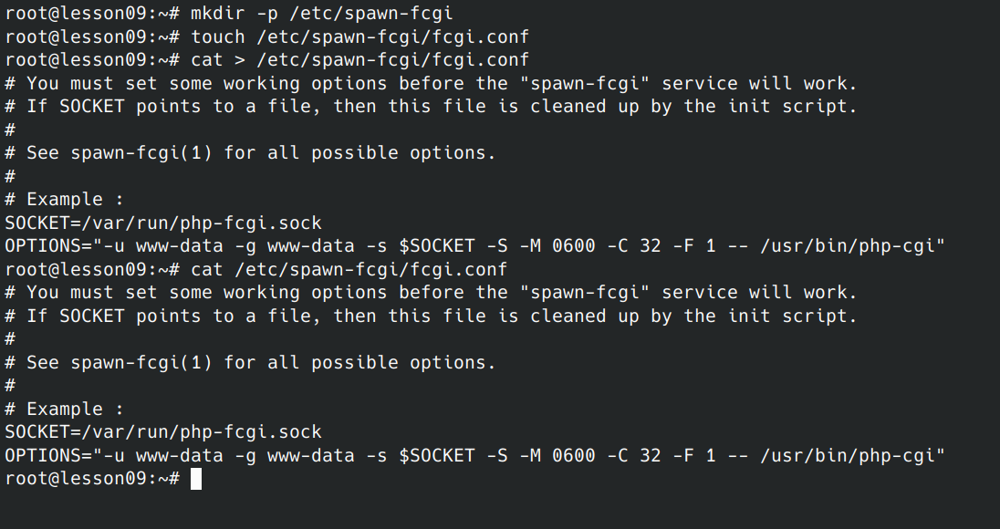
- Cоздаём unit
  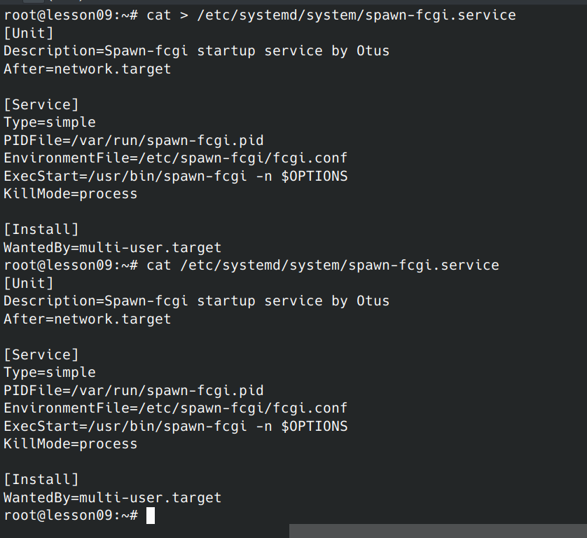
- Смотрим результат
  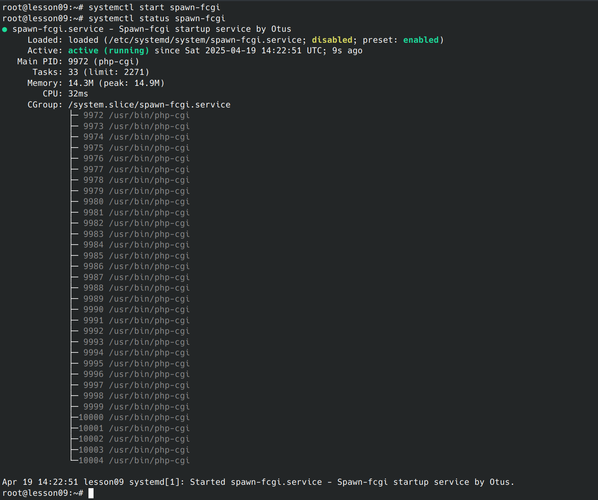

#### Доработать unit-файл Nginx (nginx.service) для запуска нескольких инстансов сервера с разными конфигурационными файлами одновременно

- Cоздадим новый Unit
  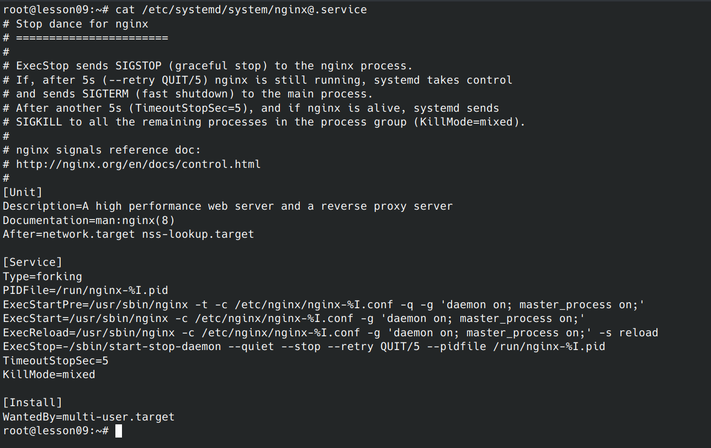
- Создаём конфиги для Nginx
  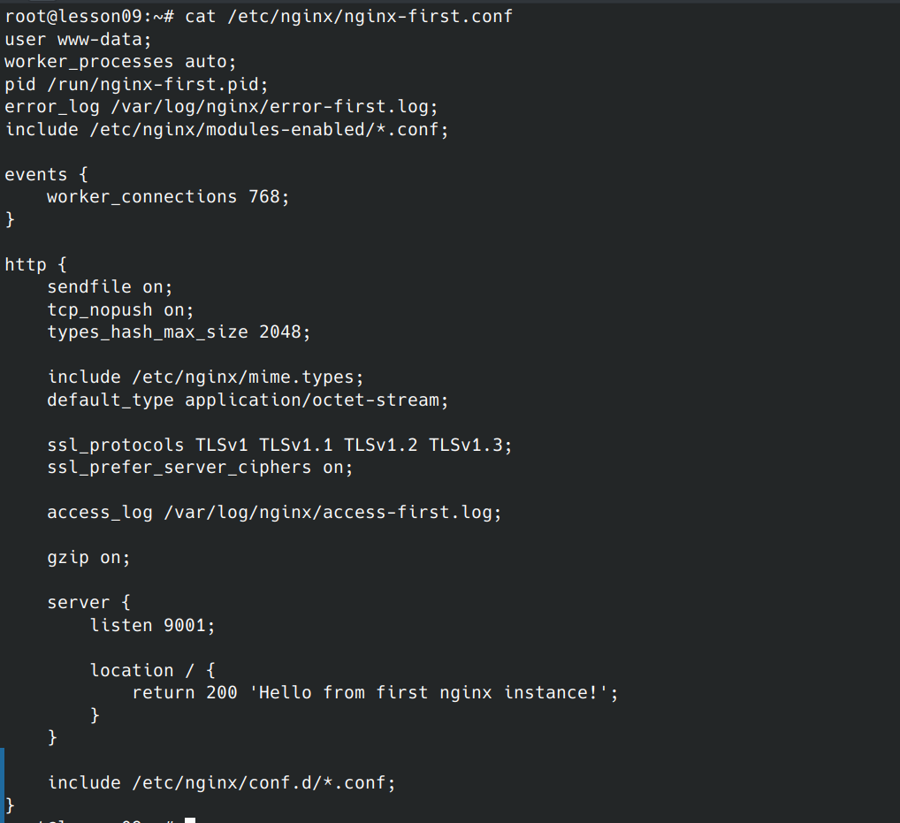
  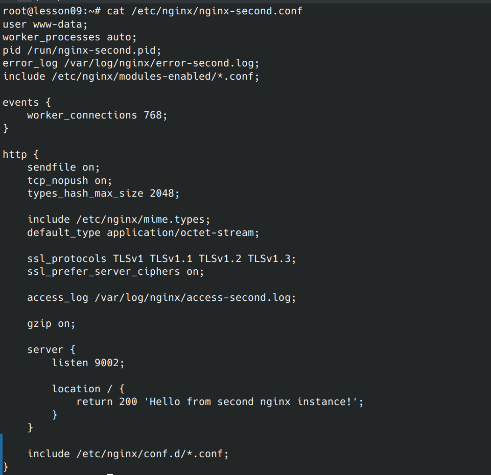
- Запускаем серверы, смотрим результат
  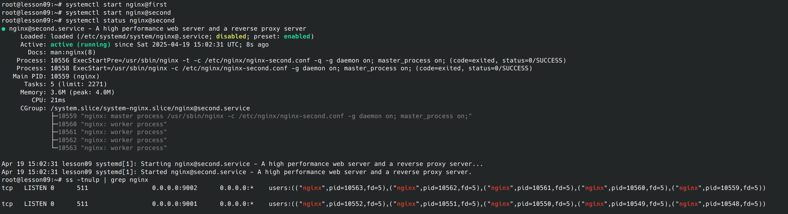
