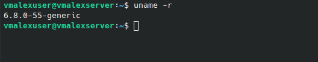
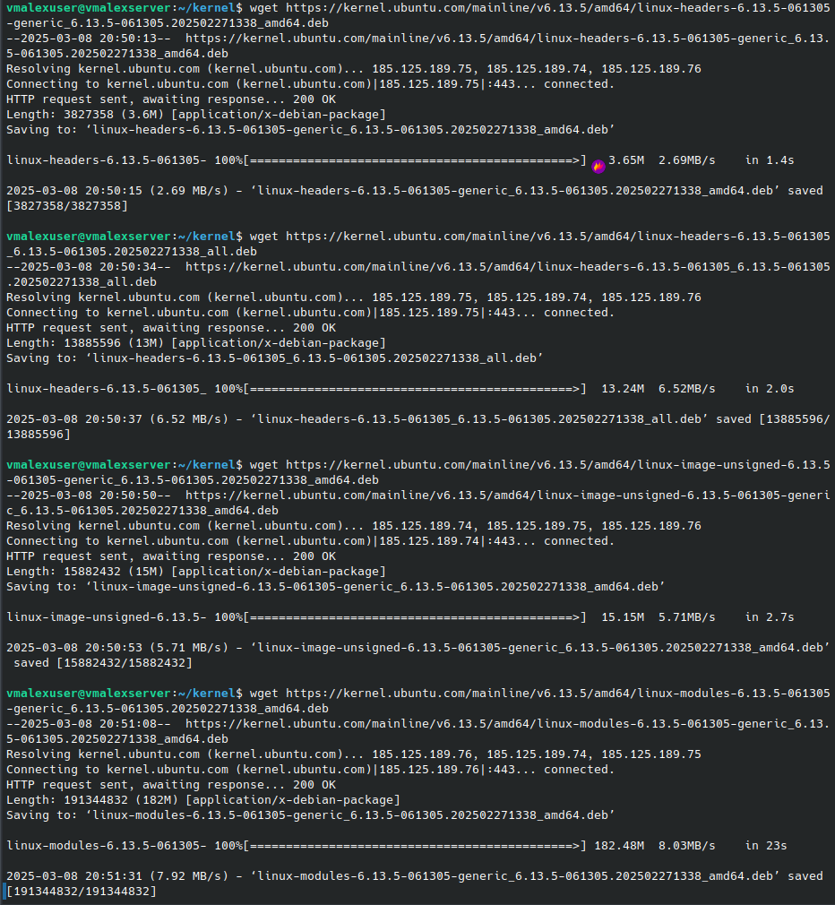
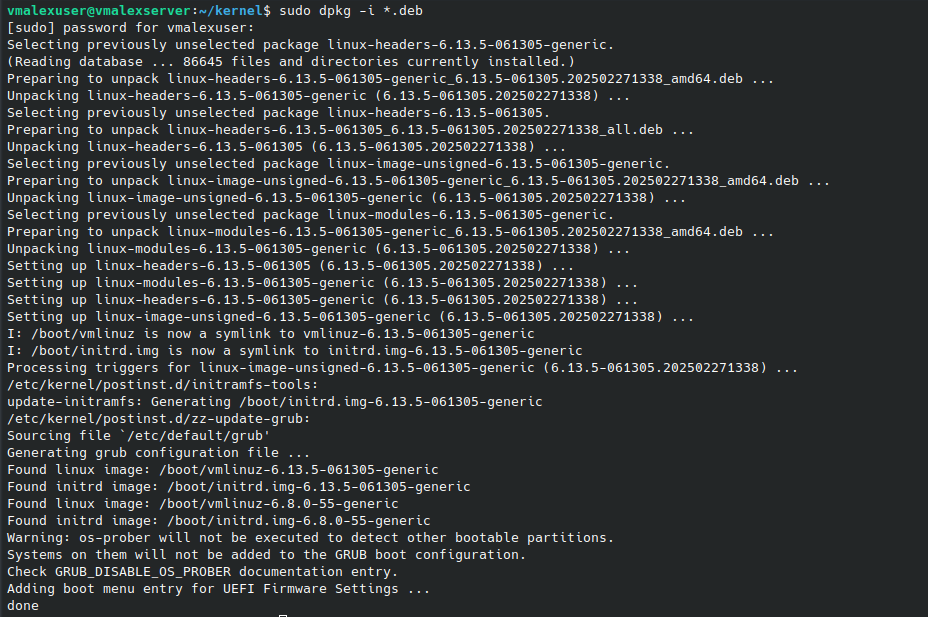
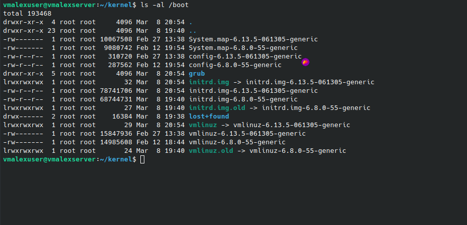
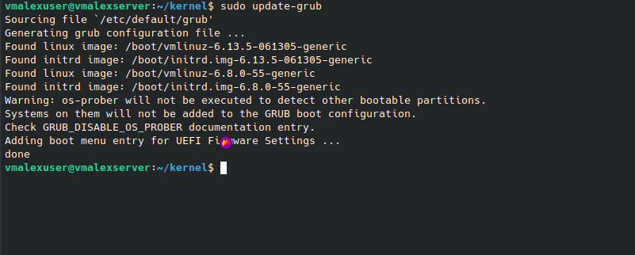
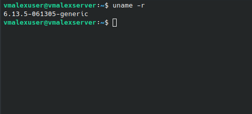

# С чего начинается Linux

## Задание: "Обновление ядра системы"

Цель: научиться обновлять ядро в ОС Linux

- Вывод текущей версии ядра
  
- Скачивание ядра
  
- Установка пакетов
  
- Проверка, что ядро появилось в /boot
  
- Обновить конфигурацию загрузчика
  
- Выбрать загрузку нового ядра по-умолчанию
  ```sudo grub-set-default 0```
- Перезагрузка
  ```sudo reboot```
- Вывод обновлённой версии ядра
  
